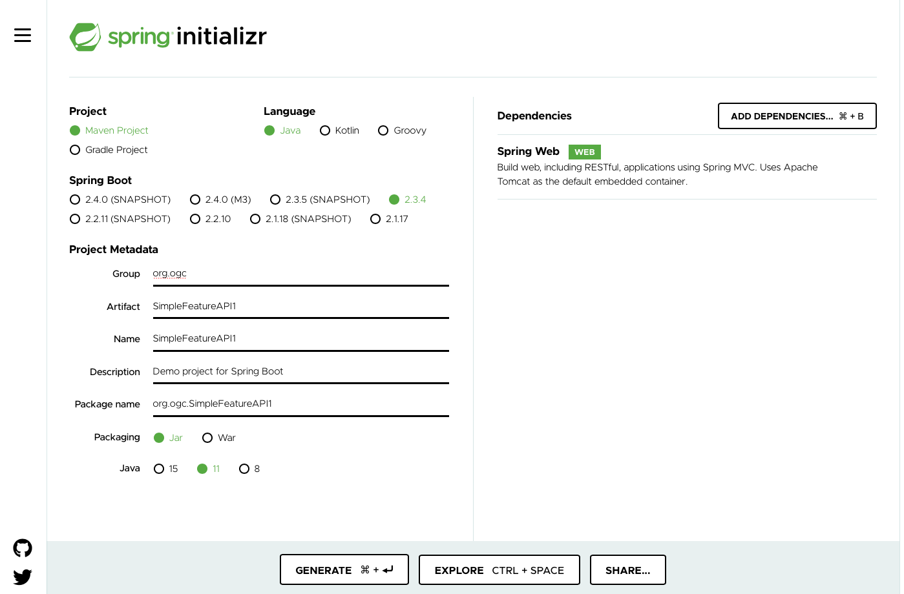
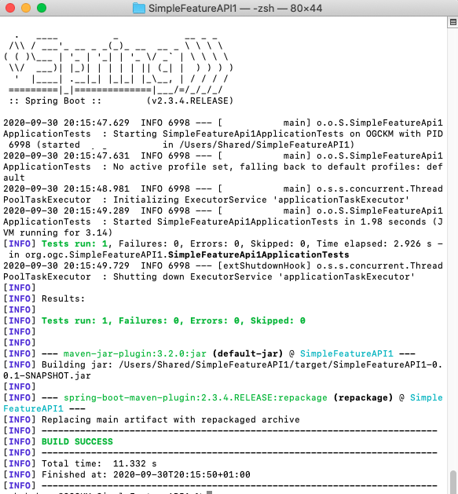
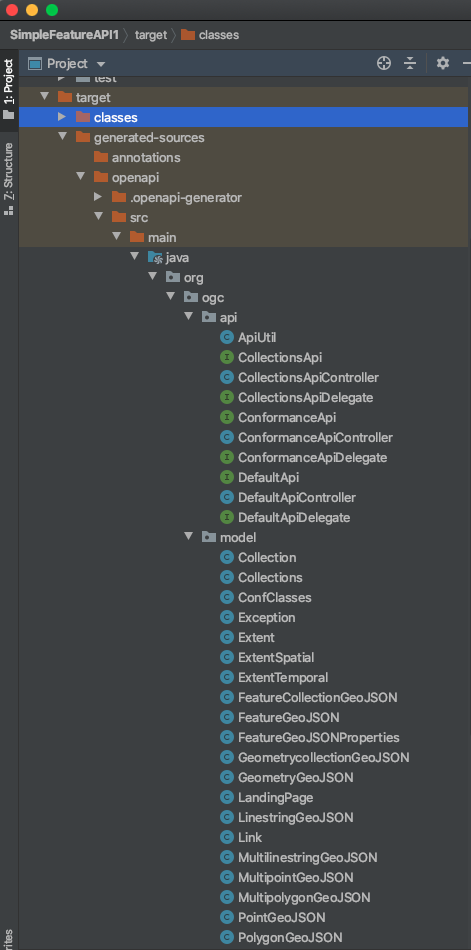

= Getting Started with Spring and OGC API - Features
:source-highlighter: pygments

== Introduction

This Getting Started guide introduces Java developers that use Spring to working with API definition files from the draft OGC API - Features specification. The guide is inspired by the https://reflectoring.io/spring-boot-openapi/[API-First Development with Spring Boot and Swagger] tutorial on reflectoring.io.

== Prerequisites

* The Java Development Kit (JDK) should be installed on your machine. You can use either http://openjdk.java.net[OpenJDK] or https://www.oracle.com/java/technologies/javase-downloads.html[Oracle JDK].
* https://maven.apache.org/[Maven] should be available on your machine.
* An Integrated Development Environment (IDE). Some popular ones include https://www.eclipse.org[Eclipse], https://netbeans.org[Apache Netbeans], https://code.visualstudio.com[Microsoft Visual Code] and https://www.jetbrains.com/idea/download/[IntelliJ IDEA Community edition].

[[step1]]
== Step 1 - Creating a basic Spring boot application

First create a basic spring boot application at http://start.spring.io

Let's call the project SimpleFeatureAPI1.

Ensure that you select Spring Web as a dependency.

Download the project by clicking on the GENERATE button.

Notice that the project contains a class called `SimpleFeatureApi1Application`. This is the Main Class for the application.

Now configure the application to run to serve requests through port 8081 by adding `server.port=8081` to the file `/src/main/resources/application.properties`. In this tutorial we use port 8081, you could use any port you wish.

[[step2]]
== Step 2 - Adding the OpenAPITools Generator to the maven project

Add the following to the pom.xml file.

[source,xml]
----
<plugin>
   <groupId>org.openapitools</groupId>
   <artifactId>openapi-generator-maven-plugin</artifactId>
   <version>4.2.3</version>
   <executions>
      <execution>
         <goals>
            <goal>generate</goal>
         </goals>
         <configuration>
            <inputSpec>
               ${project.basedir}/src/main/resources/features_example.yaml
            </inputSpec>
            <generatorName>spring</generatorName>
            <apiPackage>org.ogc.api</apiPackage>
            <modelPackage>org.ogc.model</modelPackage>
            <supportingFilesToGenerate>
               ApiUtil.java
            </supportingFilesToGenerate>
            <configOptions>
               <delegatePattern>true</delegatePattern>
            </configOptions>
         </configuration>
      </execution>
   </executions>
</plugin>

----

Then place the https://github.com/opengeospatial/OGC-API-Sprint-September-2020/blob/master/docs/Draft_Spring_Guide_for_OGC_API_Features/features_example.yaml[features_example.yaml] file at `/src/main/resources/` in your maven project.

[[step3]]
== Step 3 - Adding supporting libraries to the project

We are next going to add a series of libraries to the pom.xml file. Some
of those libraries have the same version number, so to make it easier to
manage the version numbers we will add the version numbers to the
pom.xml file as properties. This is shown below.

[source,xml]
----
<properties>
<java.version>11</java.version>
…Additional properties go here…
</properties>
----

You will need to add the following libraries.

[source,xml]
----
<dependency>
   <groupId>org.springframework.boot</groupId>
   <artifactId>spring-boot-starter-validation</artifactId>
</dependency>
<dependency>
   <groupId>io.swagger</groupId>
   <artifactId>swagger-annotations</artifactId>
   <version>${swagger-annotations-version}</version>
</dependency>
<dependency>
   <groupId>org.openapitools</groupId>
   <artifactId>jackson-databind-nullable</artifactId>
   <version>${jackson-databind-nullable}</version>
</dependency>
<dependency>
   <groupId>com.fasterxml.jackson.jaxrs</groupId>
   <artifactId>jackson-jaxrs-base</artifactId>
   <version>${jackson-version}</version>
</dependency>
<dependency>
   <groupId>com.fasterxml.jackson.core</groupId>
   <artifactId>jackson-core</artifactId>
   <version>${jackson-version}</version>
</dependency>
<dependency>
   <groupId>com.fasterxml.jackson.core</groupId>
   <artifactId>jackson-annotations</artifactId>
   <version>${jackson-version}</version>
</dependency>
<dependency>
   <groupId>com.fasterxml.jackson.core</groupId>
   <artifactId>jackson-databind</artifactId>
   <version>${jackson-version}</version>
</dependency>
<dependency>
   <groupId>com.fasterxml.jackson.jaxrs</groupId>
   <artifactId>jackson-jaxrs-json-provider</artifactId>
   <version>${jackson-version}</version>
</dependency>
<dependency>
   <groupId>com.fasterxml.jackson.datatype</groupId>
   <artifactId>jackson-datatype-joda</artifactId>
   <version>${jackson-version}</version>
</dependency>
----

So the properties should look as follows.

[source,xml]
----
<properties>
   <java.version>11</java.version>
   <swagger-annotations-version>1.5.22</swagger-annotations-version>
   <jackson-version>2.10.2</jackson-version>
   <jackson-databind-nullable>0.2.1</jackson-databind-nullable>
</properties>
----

[[step4]]
== Step 4 - Building

Now compile the OpenAPI definition by running the command:

`$ mvn clean package`

This will generate a stub of the API.

If successful, you should arrive at a `BUILD SUCCESS` message.

[[step5]]
== Step 5 - Creating the Controller

At this point, you now have the API and model stub that you will need to
implement an interface that conforms to OGC API – Features.

In the ‘target’ folder you will find a folder called ‘generated-sources’
that includes stubs for the API controllers and model.

The classes `CollectionsApi`, `ConformanceApi`, and `DefaultApi` contain the request mappings for each path specified in the OpenAPI
definition. These API stubs also have associated Controller classes
namely `CollectionsApiController`, `ConformanceApiController`, and
`DefaultApiController`.

So we next override the methods provided by the API classes
generated by the OpenAPITools Generator. Overriding these methods
enables us to add business logic to those methods.
